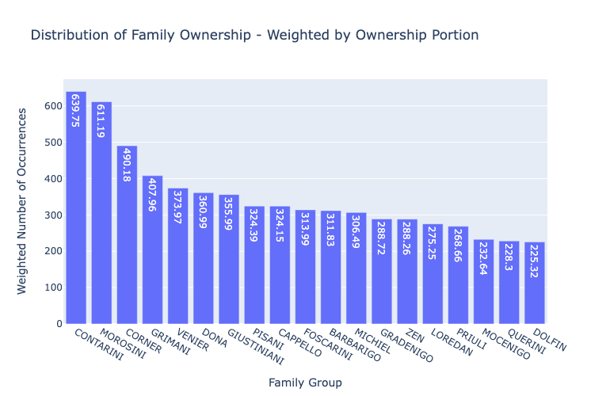

# Venezia: Catastici 1741

@author [Carlo Musso](https://github.com/CaiMusso)

This repository is the result of the work done on the 1741 Catastici between Autumn 2023 and Summer 2024, as part of the Venice Time Machine project of DHLab, EPFL. This Report collects the various README files provided in this repository in a single document. Each main directory comes with a file explaining the milestone implemented by that code.

Last update: April 13, 2024

## Contact
For any other question or curiosity that is not addressed by the documentation in this repository please contact carlo.musso@epfl.ch or carlomusso1998@gmail.com

## Introduction & Context
The 1741 Catastici is a document registering the **ownership** of parcels in Venice along with additional information such as the location, *sestiere*, tenant, rent and parcel function. This hand-written document from 1741 was digitalised in excel format by DHLab. 

The `owner_name` column of this dataset contains *noisy* text strings showing the owner(s) of the parcel and additional information about them. From these entries we were able to extract information such as: first names, family names, entity names, titles, *mestieri* and in some cases family relations as *fratelli, nipoti*, etc.

The goal of this project is to create a python pipeline that processes the initial dataset and extracts step-by-step the most information possible from the `owner_name` column. The final result is an augmented dataset with additional attributes for each row containing the extracted and standardised information. 
This final dataset is an accurate Index of parcels in Venice paired with their owners: Institutions or Families.

## Design & Technical Approach
Extracting information using a python pipeline from a historical document as the 1741 Catastici is a very delicate and intricate task that **has to be done with the highest accuracy to ensure not to tamper with historical facts**. 
For this reason, the strategy chosen to extract this information is a **rule-based dictionary-driven approach** that executes in sequential pipeline steps that categorise a specific type of owner during each stage.

### Dictionaries
During the first two months of the project all dictionaries containing family names, first names, institutions, titles, *mestieri*, cities and more were created **by hand** and *ad-hoc* for the 1741 Catastici. These dictionaries were then continuously updated and fixed during all the duration of the project. 

The creation of these dictionaries enabled a very accurate information extraction otherwise impossible to achieve with general-purpose algorithms on such noisy and delicate data as the 1741 Catastici.

More information on these dictionaries in the `dictionaries`[directory](/dictionaries/).

### Pipeline 
The 10-stage python pipeline is intended to be executed one file at the time from stage 1 to stage 10. Each stage reads the output of the previous stage, then uses the dictionaries to extract information from all entries for which this stage is responsible. The extracted information is then assigned to new standardised attributes of the dataset and the final output of that stage is written to file.

With this approach, the input and output of each stage is accessible as json file in the [pipeline_steps](/data_catastici/data_post-processing/pipeline_steps/) directory. 
More information on the pipeline, parcel assignation and information extraction in the [pipeline](/pipeline) directory.

## Conclusion & Output
The final output of the pipeline is an augmentation of the original digitalised version of the 1741 Catastici. This augmentation consists in the addition of the following attributes for each entry: *owner_code* - *owner_count* - *owner_count_remark* - *owner_entity* - *owner_entity_group* - *owner_first_name* - *owner_family_name* - *owner_family_group* - *owner_title* - *owner_title_std* -
*owner_mestiere* - *owner_mestiere_std*.

The final output is of two types and of two file formats. These files were all generated based on the input file `catastici_20240123.json` provided by Paul Guhennec, available in the [data_pre-processing](/data_catastici/data_pre-processing/) repository.

- `catastici_1741_STD.json`: json version of the final output of the pipeline
- `catastici_1741_STD.xlsx`: excel version of the final output of the pipeline

The **expanded version** is intended for data visualisation or statistics as it is easier to use. Instead of having entries with multiple owners, entries with more owners are transformed in multiple entries of one single owner. Thus, in these entries `owner_count` will be fixed to 1 and `parcel_portion` will determine the portion of each owner. Note that the `uidx` changes from type `int` to type `string` in the expanded version. For example a two-owned entry that had `uidx = 123`, now becomes two separated single-owned entries with `uidx = "123_0"` and `uidx = "123_1"`.

- `catastici_1741_STD_expanded.json`: expanded json version of the final output of the pipeline
- `catastici_1741_STD_expanded.xlsx`: expanded excel version of the final output of the pipeline

### Project Output - Shared Files
These 4 final files are also uploaded in the [epfl-timemachine](https://github.com/epfl-timemachine) GitHub organisation on the data-venice repository where data from various DHLab projects converges for shared use. [Here](https://github.com/epfl-timemachine/data-venice/tree/main/1741_Catastici_standardised) the link to the 1741 Catastici directory.

# Dictionaries: 1741 Catastici

Every dictionary and the separation and categorisation of words and mentions in these dictionaries was made by hand as a continuous work in progress during the project. It is a result of a combination of custom tools to format and clean the dictionaries and a meticulous analysis of these terms during meetings with Prof. Isabella di Lenardo and Dr. Paul Guhennec. With historical documents at hand we reconstructed the links between the Catastici mentions to Institutions and Families of 1741 Venice.

## Dictionary Structure
The dictionaries are structured in the following macro-categories:
- **ENT_dictionary**: the Entities dictionary of all mentions or sub-mentions referring to Venetian public institutions.
- **PPL_dictionary**: the People dictionary of all mentions of family names, first names, titles, *mestieri* and other people-related terminology.
- **MSC_dictionary**: the Miscellaneous dictionary contains other useful terms that don't have a common purpose but are necessary for correct information extraction such as cities, separators, unknown owners and others.
- **std_mappings**: the standardised mappings are mappings between all entity mentions and their institutions. For families, the mappings between family name variations and the actual last names. The result of these mappings creates a network that maps entity mentions to institutions and family names to family groups.

## Entity Dictionary
The Entity dictionary contains various files that separate entities and institutions into different categories according to the identity or scope of the institution.

- `entities.json`: this dictionary contains every entity mention (or sub-mention) categorised from the 1741 Catastici. It is the comprehensive set containing all the mentions from other files.
- `venezia_entities.json`: contains mentions or sub-mentions of institutions of the Repubblica di Venezia.
- `venezia_titles_entities.json`: contains mentions or sub-mentions of titles that belong to institutions of the Repubblica di Venezia.
- `guild_entities.json`: contains mentions or sub-mentions of Guild institutions.
- `religious_entities.json`: contains mentions or sub-mentions of Religious institutions.
- `religious_titles_entities.json`: contains mentions or sub-mentions of titles that belong to Religious institutions.
- `scuole_grandi_entities.json`: contains mentions or sub-mentions of the Scuole Grandi di Venezia.
- `scuole_mestieri_entities.json`: contains mentions or sub-mentions of the Scuole mestieri.
- `scuole_religious_entities.json`: contains mentions or sub-mentions of the religious institutional-owned Scuole.
- `social_care_entities.json`: contains mentions or sub-mentions of entities involved in social care and public welfare activities.
- `jew_entities.json`: contains mentions or sub-mentions related to Jewish entities.
- `unlinked_entities.json`: Includes entity mentions that could not be linked to specific categories or that belong to a category but cannot be linked to a specific known institution. This last dictionary is slightly different from the others as it is not a simple list of mentions but a more structured json object containing the list of mentions separated in their categorisation. The key `entities_type` gives us information on the categorisation of these unlinked mentions (*religious_entities*, *scuole_entities*, etc.) while the `entities_unlinked` key is the corresponding list of mentions.

## People Dictionary
The People and Families dictionary contains mentions of family names, first names and their variations. Furthermore, also categorises titles, *mestieri*, relatives and more.

- `family_names.json`: contains family names extracted from the 1741 Catastici.
- `first_names.json`: contains first names extracted from the 1741 Catastici.
- `mestieri.json`: contains job titles or professions.
- `titles.json`: contains institutional titles extracted from the 1741 Catastici and their spelling variations.
- `titles_plur.json`: contains the plural forms of the titles extracted.
- `titles_sing.json`: contains the singular forms of the titles extracted.
- `unknown_relatives.json`: contains mentions of unidentified family relations and their spelling variations (e.g. *fratelli*, *nipoti*, etc).
- `unknown_relatives_plur.json`: contains the plural forms of the unknown relatives extracted.
- `unknown_relatives_sing.json`: contains the singular forms of the unknown relatives extracted.
- `family_names_comp.json`: contains the short words that form a composed family name.

## Miscellaneous Dictionary
Miscellaneous dictionary contains other useful terms that don't have a common purpose but are necessary for correct information extraction.

- `cities.json`: contains city names extracted from the 1741 Catastici.
- `ignore_next.json`: contains terms that signal that the mentioned text and what comes after should be ignored (in practice replaced by '*' symbols) during the People-owned parcels data extraction. These mentions look quite random but are very useful to improve the accuracy of the extraction by ignoring text that is not relevant to the owner.
- `places.json`: contains names of specific places mentioned in the 1741 Catastici.
- `separators.json`: contains characters and strings used as separators of owners when a parcel has more than one owner.
- `unknown_owners.json`: contains exact mentions of explicit "unknown" property owners (e.g. *"non si pote saper"*, *"ne si sa il patron"*)

## Standardisation Mappings & Network
These files are mappings between all entity mentions and their institutions. For families, the mappings between family name variations and the actual last names. This is the result of several meetings where each single mention was looked at and manually categorised as belonging to a certain Institution or Family with the help of official websites, historical documents and the expertise of Prof. Isabella di Lenardo and Dr. Paul Guhennec.

All these standardisations and groupings are done for accuracy, statistics and visualisation purposes trying to get out of the Catastici the most accurate information without tampering with historical facts. This cannot be done without a long, dedicated and accurate human intervention.

The result of these mappings creates a network that maps entity mentions to institutions and family names to family groups. The `std_mappings` directory contains two sub-directories: one for Entities and one for People.

### People to Mentions
The directory [people_to_mentions](/dictionaries/std_mappings/people_to_mentions/) contains the file that maps each family name variation to its standardised spelling (usually the most common). Furthermore, also contains files that map titles and mestieri to their standardised version.

Note: for family name grouping, the assignation process was done through the [NameGrouper WebApp](https://namegrouper-dhlab-epfl.vercel.app) designed and implemented specifically for this task but generalisable to other datasets. All groupings were checked manually contextualising them from their parcel in the Catastici.

Here below the files in **people_to_mentions**.
- `family_name_groups.json` (mapping between family name variations and family groups)
- `mestieri_to_std.json`
- `title_plur_to_sing.json`
- `title_to_std.json`

### Entities to Mentions
The directory [entities_to_mentions](/dictionaries/std_mappings/entities_to_mentions/) contains files that map each entity to its mentions. The files are divided in categories and each file contains multiple entities/institutions with their corresponding mentions. The standardised entity is the value of the key `entity`, the entity mentions is the value list of the key `entity_mentions`; R. di Venezia and Religious entities also have the value list for the key `title_mentions` representing the title-owned mentions of a certain institution (e.g. when the *Primo prete di San Martino* owns a parcel on behalf of *CHIESA DI SAN MARTINO*)

Here below the files in **entities_to_mentions**, titles are self-explanatory.
- `mestieri_to_mentions.json`
- `religious_to_mentions.json`
- `scuole_grandi_to_mentions.json`
- `scuole_mestieri_to_mentions.json`
- `scuole_religious_to_mentions.json`
- `social_care_to_mentions.json`
- `venezia_to_mentions.json`

### The Entity Network
Here below the diagram of the mappings made on entity mentions.

# Pipeline: 1741 Catastici

The Pipeline presented here is the code performing the actual **parcel assignation** and **information extraction** from the `owner_name` attribute of each parcel in the 1741 Catastici.

The 10-stage python pipeline is intended to be executed one file at the time from stage 1 to stage 10. Each stage reads the output of the previous stage, then uses the dictionaries to extract information from all entries for which this stage is responsible. The extracted information is then assigned to new standardised attributes of the dataset and the final output of each stage is written to file.

With this approach, the input and output of each stage is accessible as json file in the [pipeline_steps](/data_catastici/data_post-processing/pipeline_steps/) directory. 

The average execution time of the full pipeline is ~5 minutes.

From a dataset point of view, the result of this pipeline can be seen in the final output files in the columns: 
- **uidx** -  unique index of type `string` in expanded dataset, type `int` in original
- **owner_code** - code of owner type
- **owner_count** - number of owners (type `int`)
- **owner_count_remark** - remark for owner count if exact number is not applicable (e.g. *fratelli*)
- **owner_entity** - owner entity name (blank if owner is not an entity)
- **owner_entity_group** - owner entity group standardisation (blank if owner is not an entity)
- **owner_first_name** - owner first name (blank if owner is not an person)
- **owner_family_name** - owner last name (blank if owner is not an person)
- **owner_family_group** - owner family group standardisation (blank if owner is not an person)
- **owner_title** - owner title (blank if owner has no title)
- **owner_title_std** - standardisation or propagation of owner title
- **owner_mestiere** - owner *mestiere* (blank if owner has no *mestiere*)
- **owner_mestiere_std** - standardisation of owner title *mestiere*
- **parcel_portion** - (only for expanded dataset) is the portion of the parcel owned by this owner (e.g. 0.33 if 3 owners own that parcel)

These columns store the result of information extraction from the `owner_name` column.

## Starting Point
The starting point is the [file](/data_catastici/data_pre-processing/catastici_20240123.json) `catastici_20240123.json` provided by Paul Guhennec. This is the digitalised version of the 1741 Catastici produced by the DHLab.

## Stage 1: Dataset setup
- average execution time: ~ 1s

In this stage, the template of the final augmented dataset is created by adding the attribute-columns mentioned above. By default every `owner_code` is set to TODO, every pipeline step will read all TODOs, process and assign its specific category of owners, then re-write the updated dataset.

## Stage 2: Assignation of empty parcels
- average execution time: ~ 2s

In this stage, all the entries with empty owner_name are marked as blank (BLK as `owner_code`), then the `unknown_owners.json` file is used to assign unknown parcels (UNK as `owner_code`).

## Stage 3: Assignation of Repubblica di Venezia - owned parcels
- average execution time: ~ 5s

In this stage, the `venezia_entities.json` - `venezia_titles_entities.json` - `unlinked_entities.json > venezia_entities` files are used to assign parcels that are owned by institutions belonging to Venice itself. These are assigned with the `owner_code` ent_VNZ, ent_VNZ_TTL, ent_VNZ_UNL respectively.

This stage fills in the attributes: 
`owner_entity` - `owner_title` - `owner_code` - `owner_count` - `owner_count_remark`

## Stage 4: Assignation of Entity-owned parcels
- average execution time: ~ 10s

In this stage, all the files: `guild_entities.json` - `jew_entities.json` - `religious_entities.json` - `religious_titles_entities.json` - `scuole_grandi_entities.json` - `scuole_mestieri_entities.json` - `scuole_religious_entities.json` - `social_care_entities.json` and the `unlinked_entities.json` for all the above are used to assign parcels that are owned by these institutions. See the `owner_code` summary map at the end of this document for more info.

This stage fills in the attributes: 
`owner_entity` - `owner_title` - `owner_code` - `owner_count` - `owner_count_remark`

## Stage 5: Assignation of People-owned parcels
- average execution time: ~ 1min 10s

In this stage, all the files in the `PPL_dictionary` directory are used to assign parcels owned by people, mainly using the function `extract_names` in `utils > utils_people.py`. The pipeline stage spots people using the family name dictionary, removes unnecessary text not related to the owner, then extracts information such as: first and last name, title, *mestiere*, family relations (e.g. *fratello*, *nipoti*) and number of owners.

Note: this stage only considers people-owned parcels owned by a single person, parcels with `separators.json` are ignored and left for stage 6 and 7. When `owner_count > 1` is assigned in this stage it is because a plural family relation was found (e.g. *fratelli*); in this case the `owner_count = 2` and the `owner_count_remark = "2+"`.

This stage fills in the attributes: 
`owner_first_name` - `owner_family_name` - `owner_title` - `owner_mestiere`- `owner_code` - `owner_count` - `owner_count_remark`

## Stage 6: Named Entity Recognition model for assignation
- average execution time: ~ 2min 50s

In this stage, a rule-based [spaCy](https://spacy.io) model for Named Entity Recognition is created to assign the remaining entity-owned or people-owned parcels (in particular those having two or more owners). All dictionaries are fed to the model and labeled with a tag (e.g. FIRST_NAME, LAST_NAME, ENTITY, SEPARATOR), the model then pattern-matches all the TODO parcels in the dataset and **finds the patterns corresponding to each tag**.

The output patterns are then saved to disk and processed in stage 7.

## Stage 7: Assignation of Owners from model output
- average execution time: ~ 15s

In this stage, the output patterns of stage 6 are processed and owners are extracted. The algorithm starts by creating owners based on the output patterns using the `update_owner` function and looping through each parcel, each owner and each pattern extracted from this owner. Then, the created owners are processed in a loop and assigned to the parcels. This stage fills in both the attributes of people-owned and entity-owned parcels according to the owner.

Note that all parcels assigned by the model are appended the string "_m" to their `owner_code`.

This stage fills in the attributes: 
`owner_entity` - `owner_first_name` - `owner_family_name` - `owner_title` - `owner_mestiere`- `owner_code` - `owner_count` - `owner_count_remark`

## Stage 8: Assignation of standardised Mappings
- average execution time: ~ 12s

In this stage, we perform the standardisation of terms by assigning standardised mappings for family names, entities, titles and mestieri.
This step is crucial for future data analysis and for the visualisation of the output. Most importantly, it is **necessary** in order to deliver results that match historical facts as opposed to ones that are influenced spelling variations.

Until this stage, we have used all dictionaries except the `std_mappings` folder. Here these mappings are crucial to standardise the terms. Standardisation depends on the category of owner.

### People Standardisation
People standardisation uses the `std_mappings > people_to_mentions` dictionaries to:
- Assign the `owner_family_group` of the corresponding `owner_family_name`. Family names are spelled differently across the Catastici, this step assigns the common name to the group (e.g. *Zustinian* is group *Giustiniani*)
- Assign the standardisation of the owner title and *mestiere*
- Propagate the plural owner titles according to the number of owners (e.g. *Nobil Homini Francesco e Pietro* becomes *NOBIL HOMO | NOBIL HOMO*)

### Entity Standardisation
People standardisation uses the `std_mappings > entities_to_mentions` dictionaries to:

- Assign the `owner_entity_group` of the corresponding `owner_entity`. Entity mentions are mapped to their institutional name (e.g. *scola di san rocco* is group *SCUOLA GRANDE DI SAN ROCCO*)
- Assign the title-owned parcels to the corresponding entity group (e.g. *primo prete di san martin* falls under group *CHIESA DI SAN MARTINO*)

This stage fills in the attributes: 
`owner_entity_group` - `owner_family_group` - `owner_title_std` - `owner_mestiere_std` 

## Stage 9: Format Verification
- average execution time: ~ 12s

This stage checks some formatting and assigns parcels as to-verify if formatting is ambiguous. The following checks are made (and more could be added):
- Family name missing for people-owned entities
- Every entry has same number of first and last names (if at least one first name is present)
- Check very long family names (more than 4 words)

This stage could modify in the attribute `owner_code` to C_VRF (as for check - to verify)

## Final Output and Stage 10: Statistics & Insights

### Final Output

The final output after stage 9 is saved in the `data_catastici > data_post-processing` folder as `catastici_1741_STD.xlsx` in Excel file and in the `pipeline_steps` folder as `catastici_1741_STD.json`.

This file has the following attributes filled in were applicable:
- owner_code
- owner_count
- owner_count_remark
- owner_entity
- owner_entity_group
- owner_first_name
- owner_family_name
- owner_family_group
- owner_title
- owner_title_std
- owner_mestiere
- owner_mestiere_std

Each parcel is assigned an `owner_code` that represents the owner type:

- **PPL** - owner is one or more people
- **PPL_VRF** - people-owned with names to verify
- **ent_VNZ** - owner is an institution of the Republic of Venice
- **ent_VNZ_TTL** - title-owned parcel of the Republic of Venice
- **ent_VNZ_UNL** - parcel of the Republic of Venice (not linkable)
- **ent_REL** - owner is a religious institution
- **ent_REL_TTL** - title-owned parcel of a religious institution
- **ent_REL_TTL_UNL** - title-owned parcel of a religious institution (not linkable)
- **ent_REL_UNL** - owner is a religious institution (not linkable)
- **ent_SCL_GRD** - owner is one of the *Scuole Grandi di Venezia*
- **ent_SCL_REL** - owner is a *Scuola* of a religious institution
- **ent_SCL_MST** - owner is a *Scuola mestieri*
- **ent_SCL_UNL** - owner is a *Scuola* (not linkable)
- **ent_SCR** - owner is a social care institution
- **ent_SCR_UNL** - owner is a social care institution (not linkable)
- **ent_GLD** -  owner is a guild entity
- **ent_JEW** - owner is a jew entity
- **ent_OTH** - owner is a non-categorised entity
- **BLK** - owner_name was blank
- **UNK** - owner_name is an explicit unknown
- **TODO** - the parcel was not assigned by the pipeline

Each of the above has a possible equivalent with "_m" appended if the parcel was assigned in stage 6 and 7 using the spaCy model.

Parcels with multiple owners have filled-in attributes which are separated by a "|" symbol. Since this is not convenient from a data analysis and visualisation point of view, stage 10 of the pipeline creates and expanded version of the dataset with one owner per entry. The rest of stage 10 is statistics and insights.

### Stage 10: Statistics & Insights
In this stage, the expanded version of the dataset is created and all statistics and insights on ownership in 1741 Venice are visualised.

#### Expanded 1741 Catastici
The expanded version in the `data_catastici > data_post-processing` folder as `catastici_1741_STD_expanded.xlsx` in Excel file and in the `pipeline_steps` folder as `catastici_1741_STD_expanded.json`. In this file, instead of having entries with multiple owners, entries with more owners are transformed in multiple entries of one single owner. Thus, in these entries `owner_count` will be fixed to 1 and `parcel_portion` will determine the portion of each owner. Note that the `uidx` changes from type `int` to type `string` in the expanded version. For example a two-owned entry that had `uidx = 123`, now becomes two separated single-owned entries with `uidx = "123_0"` and `uidx = "123_1"`.

#### Statistics & Insights
Stage 10 shows all statistics regarding distribution of ownership in 1741 Venice. A specific part on the impact of the standardisation process on misclassifications is also addressed for both Families and Entities. The notebook is self-explanatory.

##### Example: Distribution of Entity types

##### Example: Distribution of Family ownership

